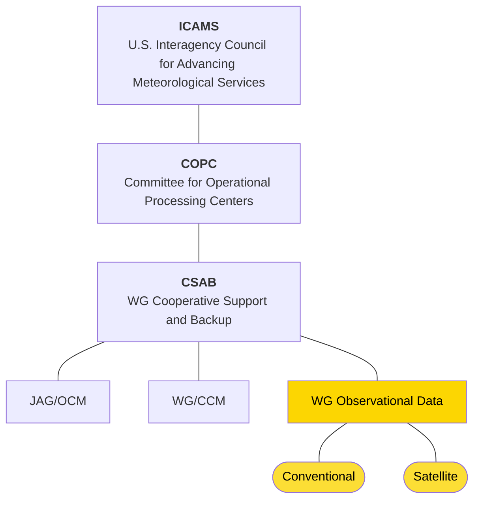

# WG/OD 

# Organization

```mermaid

flowchart TD

    ICAMS["<b>ICAMS</b><br>U.S. Interagency Council for Advancing Meteorological Services"]
    COPC["<b>COPC</b><br>Committee for Operational Processing Centers"] 
    CSAB["<b>CSAB</b><br>WG Cooperative Support and Backup"]
    OCM[JAG/OCM]
    CCM[WG/CCM]
    OD["WG Observational Data"]
    sat([Conventional])
    con([Satellite])

    ICAMS --- COPC
    COPC --- CSAB
    CSAB --- OCM
    CSAB --- CCM
    CSAB --- OD
    OD --- sat
    OD --- con

    style OD color:black,fill:#fcd602
    style sat color:black,fill:#fcd602cb
    style con color:black,fill:#fcd602cb

    click ICAMS href "https://www.icams-portal.gov/index.html" "Interagency Council for Advancing Meteorological Services"

    click COPC href "https://www.icams-portal.gov/resources/ofcm/groups/copc/copc.htm" "Committee for Operational Processing Centers"

    click CSAB href "https://www.icams-portal.gov/resources/ofcm/groups/csab/wgcsab.htm" "Working Group for Cooperative Support and Backup"
    
    click OD href "https://www.icams-portal.gov/resources/ofcm/groups/od/od.htm" "Working Group for Observational Data"
    
    click OCM href "https://www.icams-portal.gov/resources/ofcm/groups/ocm/jagocm.htm" "Joint Action Group for Operational Community Modeling"
    
    click CCM href "https://www.icams-portal.gov/resources/ofcm/groups/ccm/wgccm.htm" "Working group for Centralized Communications Management"

```
